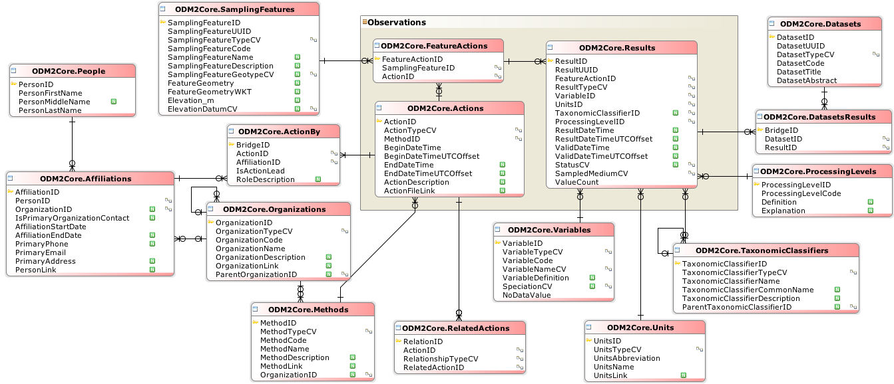
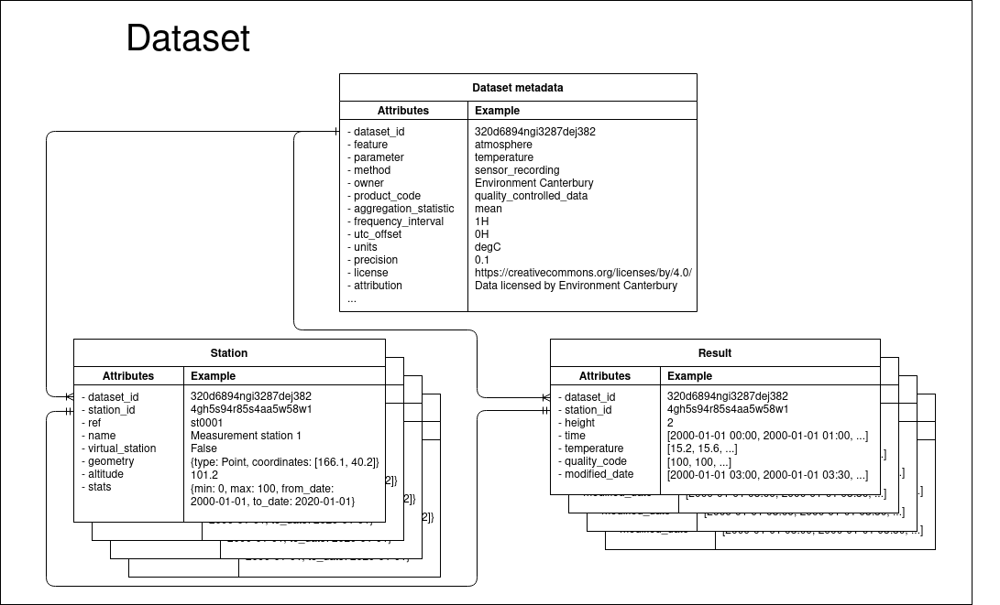

System design
=============

Background
-----------
The Tethys data model design and structure has drawn heavily from a number of sources. A major influence is the implementation of the `Observations and Measurements data model (O&M) <https://www.ogc.org/standards/om>`_ by `ODM2 <http://www.odm2.org/>`_. ODM2 is a comprehensive data model that covers most of the O&M model and have implemented the model to SQL database systems. Additionally, the ODM2 group has created a number of `extra tools and resources <https://github.com/ODM2/odm2-software-ecosystem>`_ alongside the actual database. The `controlled vocabulary <http://vocabulary.odm2.org/>`_ in particular was used as the primary vocabulary source for Tethys. For those that are interested in learning more about geospatial time series data models and structure, ODM2 has some great `diagrams and explanations <https://github.com/ODM2/ODM2/wiki/documentation>`_.

	 The entity relationship diagram of the `ODM2 Core schema <http://odm2.github.io/ODM2/schemas/ODM2_Current/diagrams/ODM2Core.html>`_.

The O&M model and subsequently the ODM2 implementation is incredibly comprehensive. You would be hard-pressed to find some geospatial time series observation data (and associated metadata) that does not fit somewhere in the model. But with this comprehensiveness comes complexity. Learning the model, the ODM2 implementation, and setting up the processes to incorporate actual data is not trivial. As scientists, we would likely only need a small subset of the model which is mostly contained within the `Results entity <https://github.com/ODM2/ODM2/blob/master/doc/ODM2Docs/core_results.md>`_. Furthermore, as this kind of model and implementation has been strongly `normalised <https://en.wikipedia.org/wiki/Database_normalization>`_ which makes it more straightforward for saving data into it, but makes reading data more difficult from a `performance perspective <https://en.wikipedia.org/wiki/Denormalization>`_.

A trimmed down version of the O&M model designed for `IOT <https://en.wikipedia.org/wiki/Internet_of_things>`_ is the `SensorThings API <https://www.ogc.org/standards/sensorthings>`_. As IOT sensors and the associated data cover a much smaller domain as compared to all possible observations and measurements, the data model and implementation are much simpler.

.. figure:: img/sensor_things_diagram.png

	 The entity relationship diagram of the `SensorThings Entities <http://docs.opengeospatial.org/is/15-078r6/15-078r6.html>`_.

In addition, The API is meant to incorporate many `existing best practices <https://en.wikipedia.org/wiki/SensorThings_API>`_ in http distribution including using `json <https://en.wikipedia.org/wiki/JSON>`_ as the transport encoding and `REST <https://en.wikipedia.org/wiki/Representational_state_transfer>`_ as the architecture style. This is a significant improvement from the earlier `Open Geospatial Consortium (OGC) <https://en.wikipedia.org/wiki/Open_Geospatial_Consortium>`_ standard the `Sensor Observation Service (SOS) <https://en.wikipedia.org/wiki/Sensor_Observation_Service>`_.

All of the previous data models and implementations were inherently derived from the O&M data model with gradual improvements in the implementation. Other organisations have also wrestled with a similar problem of effectively storing and distributing geospatial time series data.

The Climate and Forecast (CF) conventions is another data model standard developed by atmospheric scientists to be able to exchange geospatial data. But unlike the O&M data model, the CF conventions are designed to be stored in a pre-imposed data structure; namely `NetCDF <https://en.wikipedia.org/wiki/NetCDF>`_. The NetCDF data structure allows for storing multi-dimensional arrays and the associated metadata. Consequently, NetCDF files are meant to be "self-describing" as all of the information about a particular result or observation should be contained within. Multiple different data models can be fit into the NetCDF data structure and the CF conventions provide examples of many data models for different use cases. The CF conventions data models are inherently simpler than the O&M data model and cannot adequately store the same wide variety of data. Nevertheless, NetCDF files are used extensively in the hydrological sciences and its combination of simplicity and flexibility contributes to its popularity.

The `British Oceanography Data Centre (BODC) <https://www.bodc.ac.uk/resources/vocabularies/parameter_codes/>`_ created a very different kind of data model as compared to the previously mentioned models: a semantic model. Instead of looking at parameter names and attributes in tables or arrays, the BODC semantic model fully describes an observation or measurement as a readable sentence. Please see `this pdf presentation <https://www.bodc.ac.uk/resources/vocabularies/parameter_codes/documents/BODC_P01_PUV_semantic_model_Aug19.pdf>`_ for a introductory description of the semantic model. This document will not go into detail about the model, but essentially it describes an observation or measurement as a PROPERTY of an OBJECT in RELATION to a MATRIX by a METHOD. For example, the *Proportion* by *dry weight* of *particles (180-300um)* in the *sediment* by *sieving and settling tube method*. This kind of model is much better at querying than the earlier models and is designed to be used with other `Linked Data <https://en.wikipedia.org/wiki/Linked_data>`_. This model is heavily reliant on a very comprehensive and consistent vocabulary, which the BODC provides.

Tethys
------------------
Data model
~~~~~~~~~~
The Tethys data model and implementation draws on the SensorThings API for its simplicity and http best practices, the vocabularies from ODM2 and BODC, and the NetCDF file format and self-describing goal. Tethys is designed for fast read access of the results for scientific analysis and to scale easily to very large amounts of these results. The Tethys data model is primarily designed for data that has up to three spatial dimensions and one temporal dimension, but where this data does not change its spatial location over time. An example of this circumstance is a water level sensor installed in a (relatively) fixed location along a river or in a groundwater piezometer. The three dimensional spatial location defines the **Station** entity in the data model. The location of a Station is defined as the three dimensional point at the lower boundary of the atmosphere. So if the Station is on land, then it would be the latitude, longitude, and altitude at the ground surface. This becomes the reference point of the time series results. In the earlier example of a water level sensor in a piezometer, the location of the piezometer would define it's Station and the measurement reference point of the water level would be at 0 m height (most likely).

The time series data itself is stored in an entity called a **Result**. In addition to the temporal dimension, the spatial offset of where the measurement is actually taken is included as a dimension. Though in most use cases, this offset dimension is simply the height above our reference point as in our earlier example. If a weather station measured air temperature at 2 m above the ground (our reference point), then 2 m height becomes our offset. The Result may also include any `ancillary variables <http://cfconventions.org/Data/cf-conventions/cf-conventions-1.8/cf-conventions.html#ancillary-data>`_ like quality or error codes that relate directly to measurement parameter along the same dimension. Although all of the previous examples related to physical measurements in the field, the results can be derived from simulations or any other method as long as it represents a geospatial time series.

	 The entity relationship diagram of the Tethys data model. The Dataset metadata describes the dataset as a whole. One Dataset can have many Stations which contain the unique data about the Station as well as summary data about the associated Result. The Result contains all of the time series data associated with a particular Station.

Software implementation
~~~~~~~~~~~~~~~~~~~~~~~
In Tethys, all data are stored as NetCDF objects housed in an `S3 compatible object storage system <https://en.wikipedia.org/wiki/Amazon_S3>`_. An S3 object storage system was used because it is currently the cheapest cloud storage option available and allows for practically unlimited scaling both in storage and in access by users. Using the S3 API also allows for many more cloud provider options rather than being forced to use a single provider with their own unique API.

The NetCDF storage object was used because it is widely used in the hydrologic sciences, has a flexible enough data structure, the CF conventions are well developed, it can contain metadata about the results making it "self-describing", and it can be easily converted to JSON for http transfer. The current `CF conventions 1.8 <http://cfconventions.org/Data/cf-conventions/cf-conventions-1.8/cf-conventions.html>`_ are followed as closely as reasonably possible using the example called `Single time series, including deviations from a nominal fixed spatial location <http://cfconventions.org/Data/cf-conventions/cf-conventions-1.8/cf-conventions.html#_single_time_series_including_deviations_from_a_nominal_fixed_spatial_location>`_ being the dominant data model used in Tethys. Though the NetCDF objects are created following the CF conventions, more metadata is added to the objects in the form of the Dataset Metadata to be more self-describing. The `CF standard names <http://cfconventions.org/standard-names.html>`_ (vocabulary) are added to the NetCDF objects per the conventions, but as the majority of the CF standard names relate to atmospheric science the `ODM2 controlled vocabulary <http://vocabulary.odm2.org/>`_ are used as the primary parameter names.

Final remarks
~~~~~~~~~~~~~
The choices of the data model and the software implementation grew organically into the current solution. The S3 object storage and the NetCDF format placed limitations on the data model that would not necessarily exist with a more traditional relational database (e.g. more rich and comprehensive data model, more advanced transaction types, etc), but provide other benefits that outweigh these limitations (e.g. scalability, simplicity, easy user uptake, etc).

*More to come...*
